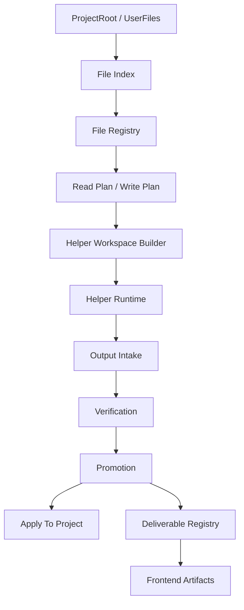

# 文件系统替换式重构计划

## 决策

本轮重构不再围绕旧链路补丁式修复。旧的 `_env` 暂存、manifest、copyback 扫描、artifact 扫描、helper 文件回收、路径别名修补只作为兼容入口和提示词参考，不再作为目标架构。

目标是建立一条新的文件系统主链路，然后逐步把旧模块改成新链路的适配层。旧行为在过渡期可以保留接口，但内部事实来源必须迁移到新文件系统核心。

## 可参考的旧提示词原则

旧提示词和错误提示中仍有可保留的原则，但需要重新整理为英文主体、中文简述的规范形式：

1. Exact paths are authoritative.  
   路径以系统提供的精确路径为准。

2. Missing resources should be requested explicitly.  
   缺资源时请求精确文件，而不是猜路径。

3. Broad source-material tasks should be split into coverage-oriented reading work.  
   大量材料任务先做覆盖式读取和证据汇总。

4. Large generation should use a framework-first workflow.  
   大型生成先确定框架，再分片执行。

5. Deliverables must be explicit, verified, and separated from internal scratch files.  
   交付物必须明确、验收，并与内部临时文件分离。

6. Main process should manage scope and evidence instead of doing bulk work itself.  
   主进程负责管理范围和证据，不承担大量读写。

这些原则只保留语义，不保留旧的实现耦合。

## 需要推翻的旧链路

以下内容不作为目标架构，只在迁移期作为兼容入口：

- `_env/.manifest.json`
- `_env/.resource_manifest.json`
- `_env/.provenance.json`
- `project_inventory.md` 作为手写主状态
- `delegate_copyback.py` 的目录扫描和文件名前缀启发式
- `workspace.py` 的 generated-file 扫描式 artifact 推断
- `expected_outputs` 同时承担提示词契约、copyback 白名单、验收目标的混合职责
- 多处重复的 `_env` 路径规范化和 project-relative 转换
- helper 输出靠自然语言报告证明是否读写成功

## 新主链路

新链路只有一个事实来源：`File Registry`。

## 新模块布局

新增：

- `app/core/filesystem/models.py`
- `app/core/filesystem/path_resolver.py`
- `app/core/filesystem/registry.py`
- `app/core/filesystem/indexer.py`
- `app/core/filesystem/planner.py`
- `app/core/filesystem/transfers.py`
- `app/core/filesystem/artifacts.py`
- `app/core/filesystem/__init__.py`

后续迁移：

- `app/llm/tools/environment_resources.py` 变为 indexer/registry 的兼容视图。
- `app/llm/tools/environment.py` 的 fetch/apply 改为调用 transfers。
- `app/llm/tools/delegate_copyback.py` 改为 output intake/promotion 适配层。
- `app/core/agent_state.py` 的 artifact/evidence 状态改为 registry 派生视图。
- 前端产物接口只读 deliverable registry。

## 核心模型

### FileRecord

- `file_id`
- `scope_id`
- `kind`
- `project_path`
- `workspace_path`
- `helper_path`
- `display_name`
- `origin`
- `owner_task_id`
- `helper_kind`
- `status`
- `visibility`
- `category`
- `size`
- `sha256`
- `declared`
- `expected`
- `verified`
- `read_state`
- `write_state`
- `apply_state`
- `errors`
- `metadata`

### FileKind

- `project_source`
- `user_upload`
- `staged_input`
- `helper_input`
- `helper_output`
- `evidence`
- `deliverable`
- `scratch`
- `backup`

### FileStatus

- `indexed`
- `planned`
- `staged`
- `available`
- `reading`
- `read`
- `partial`
- `writing`
- `ready`
- `failed`
- `verified`
- `promoted`
- `applied`
- `delivered`

### Visibility

- `internal`
- `evidence`
- `project`
- `deliverable`

## 新 API

### 路径

- `normalize_project_path(path)`
- `project_to_staged_path(path)`
- `staged_to_project_path(path)`
- `safe_workspace_path(root, path)`
- `safe_project_path(root, path)`

### 索引

- `index_project(root, scope_id)`
- `index_user_files(root, scope_id)`
- `refresh_record(record_id)`

### 计划

- `build_read_plan(request, registry)`
- `build_write_plan(request, registry)`
- `split_source_material(records, budget)`
- `split_outputs(outputs, framework)`

### helper 文件流

- `prepare_helper_inputs(task, registry)`
- `intake_helper_outputs(task, helper_workspace, registry)`
- `verify_outputs(task, registry)`
- `promote_outputs(task, registry)`

### 项目写回

- `apply_project_change(record_id)`
- `apply_project_batch(record_ids)`
- `create_backup(record_id)`

### 交付物

- `register_deliverable(record_id)`
- `list_deliverables(scope_id)`
- `download_deliverable(file_id)`

## 读文件机制重构

大量文件读取不再让主进程或单个 helper 盲读。

流程：

1. indexer 建立文件清单和分类。
2. planner 生成 read plan，包括分片、文件类型、读取方式、预期证据。
3. 主进程按 read plan 派发多个 read helper。
4. read helper 只能产出 evidence records。
5. registry 记录每个文件的 read coverage。
6. 未读、失败、截断文件进入 retry plan。
7. 汇总 helper 只消费 evidence，不重新盲读所有原文。

## 写文件机制重构

大型写入不再由主进程直接写，也不让单 helper 承担超大任务。

流程：

1. framework helper 产出框架记录。
2. planner 根据框架生成 output plan。
3. 多 helper 分片生成 helper_output。
4. verification helper 验证完整性、一致性、格式。
5. promotion 将合格输出转为 project 或 deliverable。
6. apply 或 deliver 只消费 promoted records。

## artifact 机制重构

前端产物区不再扫描工作区。

只有满足以下条件的文件能显示：

- `kind=deliverable`
- `visibility=deliverable`
- `status in delivered/artifact_ready`
- 有稳定 `file_id`
- 有用户可读 `display_name`

内部文件名、helper task id、`_env` 路径不得出现在交付物显示名中。

## 迁移步骤

### Step 1：新核心落地

实现 `models/path_resolver/registry/indexer`，不接入旧主流程，仅新增测试。

### Step 2：环境清单改为新核心生成

`environment_resources.py` 调用新 indexer/registry，然后生成旧 `.resource_manifest.json` 和 `project_inventory.md` 兼容文件。

### Step 3：helper 输入改为新计划

delegate spawn 前使用 `prepare_helper_inputs`，停止在多处手写 `_env` 复制规则。

### Step 4：helper 输出改为 intake

helper 完成后只做 output intake，不直接扫描推广到主区。copyback 只作为 legacy wrapper。

### Step 5：apply 和 artifact 切换

env apply 与 artifact API 改为 registry 驱动。

### Step 6：删除旧状态源

旧 manifest/provenance/generated scan 只保留兼容读取，不再写入主状态。测试稳定后删除。

## 第一批测试

不使用 LLM，先验证新核心：

- 中文路径规范化不乱码。
- project path 和 staged path 双向转换稳定。
- app 工程可完整索引。
- `5月雅思` 可分类为 source material，并生成分片 read plan。
- `电子231工程管理` 可识别 Office/zip，并保留 display name。
- 70+ 输出文件能作为 records 登记，不靠 copyback cap 判断。
- deliverable 只列显式登记的交付物。

## 完成标准

1. 新文件系统核心测试通过。
2. 环境资源清单由新核心驱动。
3. 旧链路的路径/manifest 逻辑开始降级为兼容层。
4. 后续 copyback/apply/artifact 可以在新 registry 上继续替换。
